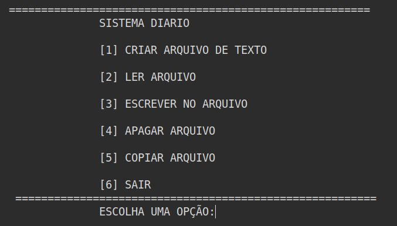

# Sistema de diário

Projeto básico em C que ajuda você a salvar suas informações pessoais com o tratamento de arquivos. Este projeto consiste em ponteiros e funções para melhor compreensão.

O sistemas apresenta as opções:

1. Criar o arquivo
2. Ler arquivo
3. Escrever no arquivo
4. Apagar arquivo
5. Copiar arquivo

Cada opção do sistema possuí sua própria função implementada.

